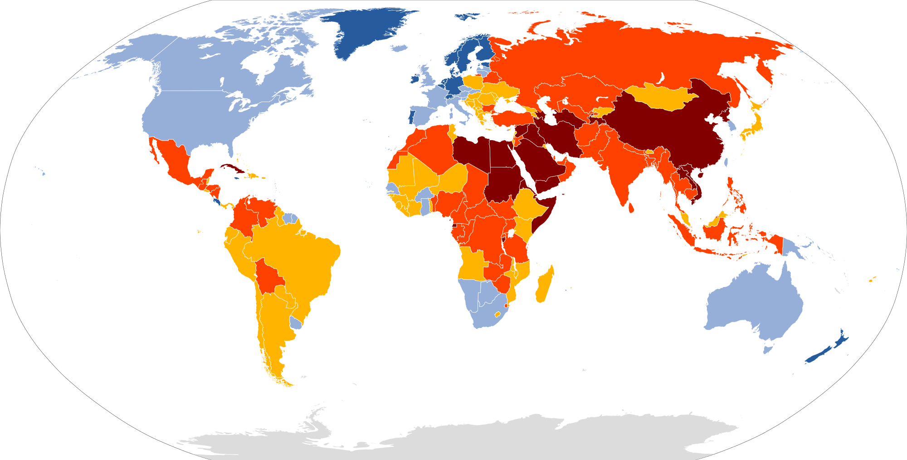
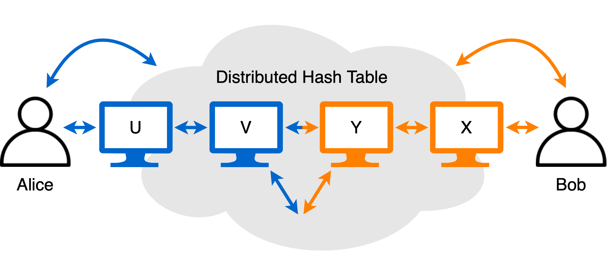

# Introduction

This is the first post in this blog, it was published on February 19, 2021.

## Motivation

### Censorship

The year of 2020 will be remembered for the pandemic, the BLM movement, and the U.S. elections among other billion of things around the globe. It is funny I even mention the third one considering how little I give a damn about U.S. politics, yet this whole story begins with [Parler](https://en.wikipedia.org/wiki/Parler) deplatforming that happened about a month ago. Let me remind you: Apple, Google, Amazon, and a few other companies terminated their service to the free speech social network for insufficient moderation effectively destroying the platform in a matter of just a couple of days. What the fuck?

OK, let me be clear with my position: I believe every private company has a right to refuse service to anyone, whether an individual or a business, but I also have my own right to despise them for exercising that. What they did was probably legal, but screw them anyway, they failed us. Regardless what these psychopathic corporations like to tell the public, they are only concerned with maximizing shareholder value, and if there is anything  even remotely resembling an image liability (through pressure by political radicals, cancel culture SJWs, you name it), they will not think twice. What disgusts me the most here is neither greed nor hypocrisy but their unwillingness to grow a pair of balls and stand up for freedom of speech.

You see, freedom of speech and expression must be absolute. You cannot have censorship-resistance with exceptions; otherwise, these exceptions could be used to remove or block anything unwanted, not only offensive. This way, the Chinese cannot access Wikipedia because of what originally started as a counter-terrorism measure, and the Russians cannot access LinkedIn because of what originally started as a children protection measure. We cannot deprive humanity of their freedom just because some small fraction of users might, unfortunately, use that freedom to spread offensive content. In the same way, you do not ban electricity because people get electrocuted.

Let us now switch from corporates to governments. Ooh, wee! Do not even get me started on that. And I am not even talking about cases like Google happily not letting people disable [SafeSearch](https://en.wikipedia.org/wiki/SafeSearch) in Indonesia because its government knows best, that is just the tip of the iceberg. I am talking about political censorship which includes silencing people with torture, gulags, and bullets. Here is the world map of the freedom of the press status:

Just look at this mess. Blue tones mean OK-ish, others not so much. This map is [NordNordWest](https://de.wikipedia.org/wiki/User:NordNordWest)'s work based on the [2020 Press Freedom Index](https://rsf.org/en/ranking) and is distributed under [CC BY-SA 3.0 de](https://creativecommons.org/licenses/by-sa/3.0/de/legalcode). Keep in mind population densities, e.g. there are about 90 times more people per unit area living in Vietnam than Australia. I am actually surprised the U.S. did so well in 2020 considering how badly they wanted [Mr. Assange](https://en.wikipedia.org/wiki/Julian_Assange) to be extradited and executed.

What would you answer your children if they asked you how in the world North Korea still exists in its current form with 25 million Koreans suffering for over 70 years and no one is doing anything about that? Or how about 28 million people in Venezuela? Or 82 million people in Iran? Giving voice to all whistleblowers and activists, especially the ones risking their lives and freedom in hostile environments is the fundamental goal of Pepe.

### Darknets

There is already [Tor](https://en.wikipedia.org/wiki/Tor_(anonymity_network)), [I2P](https://en.wikipedia.org/wiki/I2P), [Freenet](https://en.wikipedia.org/wiki/Freenet), [GNUnet](https://en.wikipedia.org/wiki/GNUnet) etc. We can run emails, message boards, [BitTorrent](https://en.wikipedia.org/wiki/BitTorrent), [Kad](https://en.wikipedia.org/wiki/Kad_network), and [IPFS](https://en.wikipedia.org/wiki/InterPlanetary_File_System) on top of them, maybe even use [Ethereum](https://en.wikipedia.org/wiki/Ethereum) smart contracts for decentralized computing. All the technology is there, why bother with something new? Well, first of all, these are all amazing projects, there is nothing wrong with them. The peculiar thing, however, is none of them except BitTorrent (and perhaps Tor) gained much popularity, neither do we see any readily available censorship-resistant communication platforms. Why is that?

I claim there are 2 main reasons for that:

- They are hard to use. The "Unix is user-friendly, it is just picky about who its friends are." aphorism still lives in most them: you may need to install a bunch of additional software (such as [JVM](https://en.wikipedia.org/wiki/Java_virtual_machine) or shared libraries) potentially dealing with a dependency hell on some platforms; read through sparse documentation and dead forums on optimal network, security, and sharing settings; carefully configure your router, computer, and client; install, study, and configure applications running on top of the darknet, i.e. repeat the steps. The reason why Tor became popular outside of research was not because it was first, but because of the hacky all-in-one Tor Browser Bundle with sane defaults.

- They prefer purity to practicality. Instead of concentrating manpower on few specific use cases, most existing tools try to conquer the world: a new internet, interplanetary, infrastructure, an application framework, APIs, a Turing-complete language on the blockchain etc. This is great and all, it is general, conceptual, modular, extensible, and stackable—everything we like—but sometimes overengineering is just overengineering given the goal. And our goal here is not to make a technical revolution, but to help as many people as we can communicate without fear of retribution.

BitTorrent evolved into something that is used by 150 million people worldwide, it seamlessly adopted [DHT](https://en.wikipedia.org/wiki/Distributed_hash_table), [PEX](https://en.wikipedia.org/wiki/Peer_exchange), [µTP](https://en.wikipedia.org/wiki/Micro_Transport_Protocol), trackerless [magnet links](https://en.wikipedia.org/wiki/Magnet_URI_scheme), and people do not even know what the hell it all means. Even though proprietary, [Skype](https://en.wikipedia.org/wiki/Skype) thrived very similarly (at least before it was crippled by Microsoft), millions of its users did not even know what peer-to-peer meant, not to mention how it worked under the hood, it just did. These two systems succeeded not because of luck but rather as a result of some excellent product decisions. We need to learn from that and reiterate.

## Pepe overview

### User level

For the messaging platform, I chose to use an [imageboard](https://en.wikipedia.org/wiki/Imageboard) similar to [4chan](https://en.wikipedia.org/wiki/4chan) or [Futaba Channel](https://en.wikipedia.org/wiki/Futaba_Channel). While not the most popular type of forum, imageboards are extremely flexible and free of junk like authentication or karma, they promote anonymity in a very practical way, and over 30 million people are already familiar with them. Perhaps, I am not a big fan of their crowded old-school design, but the initial user traction is more important than my sense of beauty, we will refine the looks through time.

That is, the Pepe imageboard is going to be the only application running on top the Pepe darknet, they are in fact inseparable. This way, we can design the network specifically for this one use case. This brings both security and performance benefits. Joining the darknet can be as simple as double clicking the application, and users do not need to install or configure any third-party browsers or proxy servers, they can just go to [localhost:8666](http://localhost:8666) using Chrome, Safari, or whatever they like, and it is going to be safe without any third-party extensions. 

Once online, users may browse existing or create new message boards about various topics in any language such as `/en/food/` or `/ja/math/`. A board is a collection of threads about something more specific, would it be an idea or a question. A thread has a collection of posts that people send replying to each other. Each post may have one or multiple attachments such as photos, videos, you name it. So that you have an idea of what it looks like, here is a screenshot of a random thread on the 4chan DIY board:

What is fundamentally different with Pepe is moderation. Instead of relying on a centralized entity with a banhammer, each board and thread owner may anonymously moderate their spaces on their own. However, nothing can actually be deleted, it can only be shadowed, and each user decides whether they want to see the light or the full version of the page at any moment in time. People can still reply to shadowed posts inside their own shadowed posts, so no one cannot silence anyone, only maintain order on the light side.

If people are no longer interested in particular threads, they will eventually become forgotten by the network and naturally disappear from their board. But if there is at least one person who is subscribed to or has archived some thread, no one in the world (even Pepe creators) can censor or somehow shut it down without hurting most of the network Pepe is running on top of.

### Network level

The three biggest problems with 4chan and similar communication platforms are:

- They use closed source software so no one can tell how secure everything is and what is really going on there.
- They are centralized, i.e. some individual or business owns the servers and fully controls the whole infrastructure.
- They collect lots of metadata including but not limited to "someone with this [IP address](https://en.wikipedia.org/wiki/IP_address) posted this at this moment in time".

Mitigating the first problem is the easiest: just use open-source software whenever possible. Regarding the centralization issue, we could switch to a decentralized solution like BitTorrent (imagine each torrent containing a thread with its posts and attachments), but that itself does not help with privacy, people can still see what others are doing. Similarly, we could tackle the privacy issue with a [VPN](https://en.wikipedia.org/wiki/Virtual_private_network) or a darknet like Tor or I2P, but that, contrary to popular belief, does not solve the centralization issue in any way. Clearly, we need the best of the two worlds. Let us fuse them together!

Here is an very simplified walk through how the network works. Imagine Bob is an undercover journalist who wants to anonymously share his report and Alice is a political activist who is interested in the investigation Bob had been doing. It all starts with Bob announcing he has the report:

1. Bob joins the network and gathers information about random peers on it through the [DHT](https://en.wikipedia.org/wiki/Distributed_hash_table). This way, Bob discovers hundreds of participants including X and Y. Similarly, Bob registers himself on the network through the DHT so that others can use him as their peer. At this moment, some people such as Bob's [ISP](https://en.wikipedia.org/wiki/Internet_service_provider) might actually learn Bob is on the network if he uses his home internet connection, but they can only guess his intentions. Unless no one knows Bob is the one behind those investigations, he should ideally be using a public Wi-Fi network or a restricted route to a trusted party instead.

2. Bob assembles a pool of ephemeral tunnels. A tunnel is a chain of peers relaying traffic for each other. Thus, Bob chooses X and Y to be a part of one such tunnel. Notice that X and Y are not related in any way, they are chosen randomly. He tells X to forward messages to him as long as the right token is provided and instructs X to ask Y to forward their messages to X if the same condition is met. At this point, Y has no idea who created the tunnel, nor does what the token represents. And because tunnels do not have a fixed length, X can only guess whether Bob is the one who initiated the tunnel construction, he might have just forwarded a message from someone else. This gives us [plausible deniability](https://en.wikipedia.org/wiki/Plausible_deniability).

3. Bob associates a key with his report. For that, he splits the report in pieces, builds a [Merkle tree](https://en.wikipedia.org/wiki/Merkle_tree) from them, and uses the root hash as the key. He then uses his X-Y tunnel to announce that key to the DHT. In order to do that, he uses [garlic routing](https://en.wikipedia.org/wiki/Garlic_routing) with multi-layer encryption so that the only thing X knows is Bob sent or forwarded something encrypted to be forwarded to Y, and Y only knows X sent or forwarded a request to assign Y as the rendezvous point as well as the token mentioned above with a certain key. At this point, no one including the peers forming the DHT knows what the key represents and, most importantly, who created it.

Let us now switch to Alice and assume for a moment she already knows the key by which she can find Bob's report. Now, the following happens:

1. Alice joins the network, learns about peers such as U and V, registers herself in the DHT, and assembles a pool of ephemeral tunnels in exactly the same manner Bob did.

2. Alice uses her U-V tunnel to do a lookup for the key she knows. Just like with Bob, no one on the network knows what Alice is doing: U only knows Alice sent or forwarded something encrypted to be forwarded to V, and V only knows U sent or forwarded a request to look up metadata associated with a certain key. Once the DHT returns the metadata to N, N transfers it back to M encrypted with a password Alice provided so that M cannot read the message, M encrypts the message again with its password and forwards it to Alice. Since Alice know both of the passwords, she decrypts the message and learns Y is a rendezvous for Bob's report and what token corresponds to it.

3. Alice uses her U-V tunnel to connect to Y in a similar manner. When Y receives the token, it forward Alice's request to X, and X forwards it to Bob so he can send his report back to Alice through X, Y, V, and finally U, end-to-end encrypted with with a password she provided. Just as before, no one understands who is doing what on whose behalf thanks to garlic routing which also employs multiple delays randomly drawn from the [exponential distribution](https://en.wikipedia.org/wiki/Exponential_distribution) by each party. Even more so, Alice has no idea where she is getting the report from, neither does Bob know who he is sending it to. Even if Bob was sending his report to malicious Eve, there would be no risk for him unless Eve controlled most of the network.

4. As soon as Alice starts downloading the report from Bob, she may announce one of her rendezvous points as well as its token to be associated with the same key the way Bob did, so that other people can start downloading the report from both Alice and Bob simultaneously. Maybe someone has already downloaded parts of the report from Bob in the meantime, so Alice can rely on the swarm of peers distributing it among each other even if Bob decided to leave the network. Alice can learn about the swarm through peer exchange or the DHT the same way she learned about Y being the rendezvous.

We can now drop the assumption Alice already knew the key of Bob's report. This is how she would obtain it:

1. After Bob announces his report on the network, he creates a thread and summarizes his findings in its first post, he also links his report as an attachment through its key. A thread is basically a regular file that encodes a [Merkle-CRDT](https://arxiv.org/abs/2004.00107) data structure with posts and their attachment previews as events. He then generates a public and private key pair for that thread, [digitally signs](https://en.wikipedia.org/wiki/Digital_signature) his post with the private key, and announces his thread on the DHT using the public key as the key of the thread in the exactly same manner he just announced his report.

2. Just like Alice would discover the swarm of peers for Bob's report, Bob uses the DHT to discover and join the swarm of peers for the board he chooses to create his thread on. In case Bob does not know the key for the board, he can first obtain it in the same way from the metaboard whose key is hardcoded to zero. Once there, he publishes the key for his thread and its first post to the swarm using [GossipSub](https://arxiv.org/abs/2007.02754). In order for his thread to be accepted by the swarm, Bob needs to first solve a [Hashcash](https://en.wikipedia.org/wiki/Hashcash) puzzle whose difficulty is determined by the message rate in the pub/sub to protect the board from spam. 

3. As Bob's message propagates through the swarm, each peer appends it to their copy of the board and starts a lightweight converging process to eventually reach a consistent state across the swarm. At the network level, boards are very similar to threads: they are keyed by the public key their owner issued for them, content moderation (shadow and unshadow) is done through digital signatures, and they are internally represented as an append-only log using Merkle-CRDTs.

4. When Alice joins the network, she downloads the relevant board from its swarm to discover Bob's thread or gets notified of it through the pub/sub if she had already been there when Bob created it. Finally, she learns the key of Bob's report and start downloading it. If she wants to thank Bob, she can reply to him in his thread, in order to do which she downloads the thread from its swarm and publishes a post in a very similar manner to how Bob published his thread on the board.

### Roadmap

Here is my vision:

| version | feature set |
| --- | --- |
| 0.2 | DHT, UDP transport, [NAT traversal](https://en.wikipedia.org/wiki/NAT_traversal). |
| 0.4 | Swarms, tunnels, garlic routing. |
| 0.6 | Merkle-CRDTs, GossipSub, Hashcash. |
| 0.8 | Boards, threads, posts, attachments. |
| 1.0 | Decent UI, UX, test coverage, docs. |
| 1.2 | Restricted routes, traffic obfuscation. |
| 1.4 | HTTPS and [steganography](https://en.wikipedia.org/wiki/Steganography) transports. |
| 1.6 | Cross-board distributed search index. |
| 1.8 | Lightweight native Android client. |
| 2.0 | [Bluetooth mesh](https://en.wikipedia.org/wiki/Bluetooth_mesh_networking), [Wi-Fi Direct](https://en.wikipedia.org/wiki/Wi-Fi_Direct) routing. |

This is pretty ambitious and will take quite some time to implement, test, and document. There are still a lot of unknowns such as best network parameters, peer scoring functions, and other heuristics. Something like these is typically approximated using machine learning, but we cannot do even that because of the distributed nature of the system (hence, lack of datasets to train on). We can reuse years worth of experimental data from the existing projects such as BitTorrent, Tor, and I2P, but a lot of tuning will still be required until converging to the optimal levels of performance, security, and stability.

For the development process, I am going to adopt the same enhancement proposal system as behind Python with its PEPs and BitTorrent with its BEPs. During the next few weeks, I am going to write the first several Pepe Enhancement Proposals and publish them in the [peps](https://github.com/1B677B8F8BB20100/peps) repository. Whereas bug reports may go directly under the Issues tab in the [pepe](https://github.com/1B677B8F8BB20100/pepe) repository, I am expecting all non-trivial feature requests come with PEP pull requests. You can see those as mandatory design documents if you like. Once we reach version 0.8, you are welcome to join the development in `/en/pepe/` instead of Github.

## Donations

Pepe is never going to have paid ads, any fees, premium memberships, or telemetry to sell. At the same time, I am going to be its lead developer (actually, the only developer for now) and the sole maintainer. As many of you, I have a 40-hour-a-week job and a family to support. I am planning to work on Pepe on weekends no matter what, but it is going to take a long time to get to a release in this way. With your support, I hope to switch to working on Pepe full time. Please consider donating using these methods:

- [Bitcoin](https://en.wikipedia.org/wiki/Bitcoin) (BTC) which is the most popular decentralized cryptocurrency with enormous market capitalization. If you are interested, you can learn how to use it at [bitcoin.org](https://bitcoin.org/) and donate using this address:

  `bc1qs9pksy354fjksldtm0f566lmqrafzqurp8tfm8`

- [Ethereum](https://en.wikipedia.org/wiki/Ethereum) (ETH) which is one of the most technologically advanced blockchains whose cruptocurrency is the second-largest by market capitalization, after Bitcoin. You can learn how to use it at [ethereum.org](https://ethereum.org/) and donate using this address:

  `0x7414938a215ff3a9D24073Fcb17750D0CE3E7bDC`

- [Monero](https://en.wikipedia.org/wiki/Monero) (XMR) which is a privacy-focused cryptocurrency that uses an obfuscated public ledger meaning anyone can send or broadcast transactions, but no outside observer can tell the source, the amount, or the destination. You can learn more about it at [getmonero.org](https://getmonero.org/) and  donate using this address:

  `48wc7RZfQFo2VUydaoA6PM42GHmy6GKYJ2zXGmRic6J4hdTWw5Gik4NfiS6KjT9ZpPddNSb2W96ixQ59KXakYGMw9Z3D1Yk`

I am going to publish a post with the current progress and how much money I could collect through donations every month or two. You do not have to pay to get access to them (they are going to be published in this blog) or to use Pepe once it is ready. Pepe is going to be available for free for everyone and released under the [GNU AGPLv3+](http://www.gnu.org/licenses/agpl-3.0.html).

## Anticipated questions

### Who are you?

I am just a regular schnook.

### Why are you staying anonymous?

I do not like fame. This specifically includes that part where people who like to get offended about stuff go crazy and burn down my house.

### Why is your Github user name so strange?

I chose it to be the same as the [GPG](https://en.wikipedia.org/wiki/GNU_Privacy_Guard) key ID I use to sign everything including my commits:

### Why Pepe, is it not a hate symbol?

There is a huge misunderstanding, Pepe the Frog has always been a symbol of resistance in underground culture, it was journalists who decided it was evil without understanding a damn thing.

### Why only cryptocurrencies for donations?

It the only feasible way for us to significantly speed up the development without revealing your or my identity.

### What is the monetization scheme of Pepe?

There is none and will never be. No ads, no fees, no premium shit, no telemetry. Free as in freedom.

### Can I sell my stuff on Pepe?

Yes, you can. If it is something digital, I encourage you to price not one copy, but releasing it to the public domain.

### What if Github decided to block you?

It should not as I am not breaking any terms of service, acceptable use policies, or community guidelines. In an unlikely event an external force makes Github suspend or delete my account, we will continue development on `/en/pepe/` inside Pepe itself. Just in case, consider saving my [public key](https://raw.githubusercontent.com/1B677B8F8BB20100/1B677B8F8BB20100/master/public-key.txt) so that you can later verify my commits and releases.

### Is using or developing Pepe legal?

I am not a lawyer and this is not a legal advice, but yes, it is legal to both develop and use Pepe, at least the last time I checked (see when this post was last updated at the top of the page). The only known exception here is France where you could be restricted by [DADVSI](https://en.wikipedia.org/wiki/DADVSI) in which case consult with your lawyer.

### How secure is Pepe going to be?

Reasonably for practical use. I am hoping to eventually surpass the levels of security of I2P. You should read about its [thread model](https://geti2p.net/en/docs/how/threat-model) because it mostly applies to Pepe as well. Using restricted tunnels should mitigate biggest vulnerabilities such as intersection and traffic analysis attacks for those who really care about it.

### How fast is Pepe going to be?

Reasonably for practical use. We should get the order of megabits per second of bandwidth. As for latency, do not expect miracles, it will be in the order of seconds.

### Is Pepe going to support direct messages or private groups?

I believe in a culture of openness and feel that exclusivity has very little value, especially in the presence of strong anonymity. You are still free to use public-key cryptography, but it will not likely be integrated to the imageboard.

### Do you seriously believe Pepe might be useful in North Korea?

Believe it or not, but Andoid-based smartphones are available for purchase and are in fact quite popular among North Korea's citizens. There is even a 3G network that covers over 90% of the population, even without apparent gateways to the internet. Once Pepe works over Bluetooth mesh (which should be by v2.0), people should be able to exchange information anonymously and self-organize in big cities to do whatever they feel like doing.

### On what platforms is Pepe going to be available?

I am planning to gradually increase support for various operating systems and hardware architectures with each new version of Pepe:

| | GNU/Linux | macOS | Windows | \*BSD | Android |
| --- | --- | --- | --- | --- | --- |
| **64-bit x86** | v0.2 | v0.2 | v0.6 | v0.4 | v1.8 |
| **32-bit x86** | v0.4 | probably never | v0.6 | v0.4 | v1.8 |
| **64-bit ARM** | v0.4 | v0.8 | no idea when | v0.6 | v1.8 |
| **32-bit ARM** | v0.2 | N/A | no idea when | v0.6 | v1.8 |
| **64-bit RISC-V** | v1.2 | N/A | N/A | no idea when | N/A |

### Why is there no iOS among the supported platforms?

Because there is no feasible way to install applications outside of Apple's App Store without jailbreaking (which might still be illegal in some jurisdictions) the device you "own".

### In what programming language is Pepe going to be written?

For the most part, in [Go](https://en.wikipedia.org/wiki/Go_(programming_language)). I spent quite some time choosing between C and Go and decided to go with the latter for multiple reasons:
- A great concurrency model with a mature M:N scheduler instead of a callback hell with libuv.
- Great core language and standard library functionality including hash maps, UTF-8, non-blocking I/O, RPC, SHA-2, AES, Ed25519, TLS 1.3, HTTP/2, unit testing etc.
- Decent machine code generation, painless cross-compilation, static linking, reproducible builds etc.

I love Rust, but its ecosystem is still too immature, so practicality wins here again. I have been using C++ for almost half of my life, and I still cannot stand this Stroustrup's monster. As for Java, I have big plans for running Pepe on [SBCs](https://en.wikipedia.org/wiki/Single-board_computer), and they do not tend to have much RAM, so no way.

### Why did you choose AGPL over GPL or, say, MIT?

The [GNU AGPL](https://en.wikipedia.org/wiki/GNU_Affero_General_Public_License) is recommended by the [FSF](https://en.wikipedia.org/wiki/Free_Software_Foundation) for any software that will commonly be run over a network. This is also a nice opportunity to legally protect our community from for-profit organizations that generally avoid AGPL software like the plague and government agencies that will have to either break the license terms in order to mess with the network or be content with a research pool of nodes that do not drop requests from modified clients.

### Where does Pepe stand with respect to the CAP theorem?

It is [AP](https://en.wikipedia.org/wiki/CAP_theorem). In other words, Pepe is going to have [eventual consistency](https://en.wikipedia.org/wiki/Eventual_consistency).

### Where does Pepe stand with respect to the anonymity trilemma?

It is strong anonymity and low bandwidth overhead. But latency will be measured in seconds, yes.

### Why is Pepe not built on top of a blockchain?

It sort of is, actually. Each thread, each board, and the metaboard are represented with a [Merkle-CRDT](https://arxiv.org/abs/2004.00107) data structure which is basically a blockchain but with multiple branches.

### Why are you using bidirectional tunnels?

There is very little evidence that [unidirectional tunnels](https://geti2p.net/en/docs/tunnels/unidirectional) are superior from the security perspective, so I decided to go with bidirectional ones for practicality reasons.

### What DHT are you going to use?

Instead of mainline [Kademlia](https://en.wikipedia.org/wiki/Kademlia), I am planning to use a slightly modified version of [R⁵N](https://grothoff.org/christian/nss2011.pdf) as it outperforms Kademlia in restricted networks and is more resistant to some of the known vulnerabilities such as poisoning and Sybil attacks. But this has not been finalized yet.

### How can I reach out to you privately?

You cannot, sorry about that. Feel free to reach out to me publicly on [Github](https://github.com/1B677B8F8BB20100) instead. I am most probably not going to spend time answering random questions though, please stick to the bug report and PEP formats (or fixing/implementing them in pull requests).
